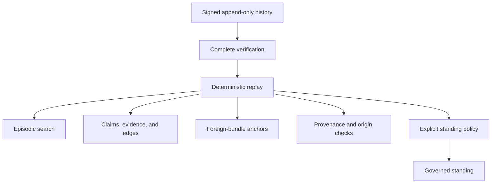

# Magpie

[](https://github.com/noctem-o/magpie/actions/workflows/ci.yml)


**A local-first, replayable memory kernel for AI systems.**

Magpie keeps a signed history of what was recorded and derives everything else from that history. It tracks claims, evidence, provenance, search state, and policy conclusions without quietly treating any of them as the same thing.

> **Conserve the log. Derive the rest.**

A search hit is not evidence. Verified bytes are not automatically well-sourced. Two matching reports are not automatically independent. A serialized audit result does not gain authority because somebody loaded it again.

Magpie is deliberately fussy about those distinctions.

| Historical record | Portable verification | Governed standing | Authority boundary |
| --- | --- | --- | --- |
| Signed, append-only hash chain | Rust, Python, and Go complete conformers | Policies v0 through v4 | No ambient authority |
| SQLite L0 + deterministic replay | Frozen 432-case corpus | Caller selects the policy | Trust in the verifying key stays external |
| Explicit checkpoint expectations | Three-way differential + bounded Rust assurance | No automatic `latest` | Optional Deadbolt protocol seam |
| Corrections remain historical events | Exact supplied finite histories only | Audit traces are explanatory | Derived state cannot rewrite history |

> [!IMPORTANT]
> A successful check grants only the claim defined by that check. It does not silently establish provenance, trust, freshness, global completeness, key ownership, or permission to act.

Magpie is an experimental Rust workspace, not a finished memory product. This checkout implements standing policies v0 through v4 and complete portable-history conformers in Rust, Python, and Go, with an exact three-way differential runner. The latest GitHub source release is [v0.2.0](https://github.com/noctem-o/magpie/releases/tag/v0.2.0), while the latest tracked release contract and workspace package version remain v0.1.0. Development has moved beyond both boundaries.

## Why Magpie exists

AI memory gets dangerous when "stored", "verified", and "believed" collapse into one state.

Suppose an agent remembers a claim from last week.

The bytes may still exist, but where did they come from?

Maybe the artifact has a valid digest. That proves something about those bytes, but not who produced them.

Maybe two reports agree. Did they actually come from separate origins, or did one copy the other?

Maybe a deterministic checker passed. What exact proposition did it check?

Maybe yesterday's policy considered the claim supported. Does today's caller even intend to use that policy?

Magpie refuses to answer those questions by implication.

It keeps the pieces separate until an explicitly chosen rule says what may follow.

A few terms appear throughout the code and documentation:

- **Observation.** What a recorded event said.
- **Availability.** Whether the exact bytes required for a computation were supplied.
- **Verification.** Whether those bytes or a signed history satisfy a named checking procedure.
- **Provenance.** How an artifact is connected to a recorded acquisition or derivation.
- **Origin admission.** Whether a contribution is admitted into an exact origin comparison.
- **Eligibility.** Whether a piece of evidence may participate in a particular policy rule.
- **Governed standing.** The conclusion produced by the exact standing policy the caller chose.

The signed append-only log is historical authority relative to the verifying key supplied by the caller.

Search indexes, claim graphs, standing results, and audit traces are derived from it.

They can explain what Magpie concluded. They cannot rewrite the history that produced the conclusion.

## What works today

This checkout has a real experimental kernel behind the design.

It includes:

- a frozen signed event format with canonical encoding and golden vectors
- an append-only hash-chained log with Ed25519 signatures
- an independent unprofiled Python chain verifier retained for compatibility
- an owner-approved, frozen 432-case exact-byte portable-verifier corpus
- a crate-internal Rust complete portable-history conformer that drives all 432 frozen cases through one production path
- a separate readable Python complete conformer for the selected portable profile and language
- a standalone Go complete conformer with no Rust or Python verifier dependency; its exactly approved `filippo.io/edwards25519 v1.2.0` primitive dependency is vendored for offline builds
- a three-way differential runner that compares every governed result field for all 432 frozen cases
- non-normative bounded Rust fuzz/metamorphic assurance over that production conformer path
- a supported local SQLite L0 store with bounded creation and verified reopen
- stale-writer detection and atomic successor append
- complete history verification before deterministic replay
- explicit verified-prefix and checkpoint expectation APIs
- byte-identical regeneration of derived state
- typed claims, evidence, and justification edges
- immutable supplied content for standing computations
- provenance, origin admission, and contribution audits
- governed standing policies v0 through v4
- an optional protocol connection to sealed Deadbolt execution evidence
- deterministic audit output that cannot be loaded back in as authority

The scope is still intentionally small.

There is no general ingestion system, no autonomous research agent, no ordinary governed claim writer, and no magic "latest truth" resolver.

The frozen portable corpus is normative oracle material, not a verifier by itself. This checkout has complete Rust, readable Python, and standalone Go conformers for the selected ADR-0010 profile and frozen portable-history language. The tracked differential runner verifies the frozen manifest and all case bytes before requiring exact agreement on all seven governed fields — `verdict`, `class`, `line`, `record_index`, `event_count`, `tip`, and `ordered_recomputed_hashes` — for all 432 cases. That is bounded cross-language conformance evidence for this exact profile and corpus, not a proof of verifier correctness, universal input equivalence, key trust, currentness, or release-environment portability.

## Quick start

Run the full workspace tests:

```sh
cargo test --workspace --locked
```

Run the deterministic standing tour:

```sh
cargo run --locked --example tour -p magpie-claims
```

The frozen tour creates and verifies one signed history, resolves policies v0 through v2, deletes the derived state, replays the history, and checks that regeneration is byte-identical.

Policies v3 and v4 are implemented and tested separately. They are not part of the frozen tour output.

You can also verify the golden event chain with the independent Python implementation:

```sh
python tools/verify_chain.py \
  crates/magpie-log/testdata/golden-v1.jsonl \
  ea4a6c63e29c520abef5507b132ec5f9954776aebebe7b92421eea691446d22c
```

That verifier checks canonical encoding, sequence numbers, previous-hash links, stored hashes, signatures, genesis binding, and payload validity against the verifying key you supply.

## How Magpie works



Magpie first reads one exact record snapshot.

It verifies that complete supplied snapshot before any authoritative replay result is published. The same retained events then feed the derived projections.

Some standing policies also need external artifacts or foreign bundles. Those bytes must be supplied explicitly in an immutable content closure. Resolution does not wander onto the filesystem, query a content store, or make a network request to fill in something that happens to be missing.

That is important because otherwise replay would stop meaning replay.

The rough progression is:

1. Supply the exact bytes the computation needs.
2. Run the named verifier for the exact predicate it knows how to check.
3. Establish the permitted provenance relationship.
4. Evaluate origin admission under the selected policy.
5. Determine which contributions are eligible for the standing rule.
6. Apply the explicitly chosen standing policy.

Each step has a smaller claim than the next.

**Verification is not provenance.**

**Provenance is not proof of independent origin.**

**Independent origin is not statistical independence.**

**Eligibility is not standing.**

## Standing

Magpie calls a policy-produced claim status its **governed standing**.

Current standing values include `Conjectured`, `Supported`, `Settled`, and `Refuted`.

A status merely stored in an event does not become governed standing. Magpie retains raw historical status for audit, but only a named resolver can produce the governed result.

[ADR 0003](docs/adr/0003-canonical-definition-of-standing.md) defines the standing model.

Current policies are:

| Policy | What it adds | Maximum effect |
| --- | --- | --- |
| v0 | Candidate explanation, ceilings, and blockers | Explains possible evidence without promoting standing |
| v1 | Exact same-replay Deadbolt occurrence and inclusion rule | May produce `Settled` for the exact proposition |
| v2 | Exact deterministic direct support | May produce `Supported`, never `Settled` |
| v3 | Narrow external-report corroboration | May produce `Supported`, never `Settled` |
| v4 | Subject-bound deterministic direct refutation | May produce governed `Refuted` under conservative precedence |

These policies do not form an automatic upgrade chain.

There is deliberately no `resolved_standing_latest`.

The caller chooses the policy.

### A note about v3 and origin groups

Current v3 can count distinct admitted origin groups inside one exact comparison namespace.

That does **not** mean Magpie has proved those groups statistically, causally, or organisationally independent.

There is another important limit.

The existing compatibility path does not independently authenticate the claimant's right to assign an origin group. [ADR 0007](docs/adr/0007-authority-bound-origin-corroboration.md) defines the stricter authority-bound model needed to close that gap.

ADR 0007 is accepted doctrine. Acceptance of the ADR does not mean that authority-bound runtime has already been implemented.

Until that work lands, current v3 results must be read under the existing compatibility semantics rather than reinterpreted as authenticated grouping decisions.

### Why v4 owns its subject

An earlier direct-refutation design exposed a nasty substitution problem.

Evidence could provide some unrelated `witness_hex` value. If that value differed from the expected digest, the system could observe inequality and accidentally talk as though the claim itself had been disproved.

It had not.

It had only shown that evidence-selected bytes differed from the expected digest.

That design was rejected.

The implemented v4 rule instead keeps both the subject bytes and expected digest on the claim. Evidence can identify and bind the route to that claim, but it cannot substitute a different subject.

A parse failure or binding failure stays a failure.

It does not turn into inequality.

Inequality does not turn into falsity unless the complete v4 rule says it may.

Only the exact eligible negative path can produce governed `Refuted`.

If the inherited governed standing is already `Supported` or `Settled`, v4 preserves it behind an explicit contradiction blocker instead of casually overwriting it.

Several eligible refutation candidates also do not amplify the result. The direct rule applies at most once.

## Rules Magpie refuses to blur

### History is append-only

The log has no update or delete operation.

Corrections are later signed events. The earlier record remains part of history.

The log itself does not decide that the newer event supersedes the older one. Supersession and currentness are derived questions with their own policy.

The genesis event makes the chain self-describing, but trust in the verifying key still comes from outside the log.

### Verified history is not current history

This is one of the easiest claims to overstate.

If Magpie successfully opens a verified prefix, it has completely verified the exact history supplied in that SQLite snapshot under the selected key and limits.

That says nothing about whether a longer valid history exists somewhere else.

It does not establish freshness.

It does not establish "latest".

It does not establish global completeness.

ADR 0009 makes this separation explicit.

`open_containing_checkpoint_v0` can additionally ask whether the supplied verified history contains one exact checkpoint supplied by the caller.

Even then, satisfying the checkpoint does not prove that the checkpoint itself is trustworthy, securely retained, current, canonical, or protected against rollback.

Those are separate problems.

### A derived result must name what produced it

Standing can depend on more than a log tip and policy name.

It may also depend on exact supplied artifacts, caller-selected subjects, inherited results, and future authority inputs.

ADR 0008 therefore requires every governed detached result to carry enough immutable information to identify the complete computation that produced it.

If a result can change when an input changes, that input cannot disappear behind an ambient lookup, mutable alias, or implementation default.

Two equal-looking results produced from different semantic inputs are not automatically the same derivation.

### Audit output is not authority

Magpie produces deterministic standing and contribution traces so a reviewer can inspect how a result was reached.

Those traces are explanations.

They do not become authority-bearing input if someone serializes them and loads them later.

Authority-bearing audit types have no public caller-supplied deserialization path back into resolution.

The arrow goes one way.

### Failure is not falsity

Missing bytes do not mean "false".

Malformed metadata does not mean "false".

A bad signature does not mean "false".

A failed binding does not mean "false".

An incomplete audit does not mean "false".

They mean the computation failed in the specific way Magpie reports.

This sounds obvious until a negative policy starts consuming verifier output. Then it matters a lot.

### Repetition is not strength

Ten copies of the same evidence do not become ten independent reasons.

Repeated anchors and repeated audit results do not gain authority merely because there are more of them.

Current v3 counts distinct admitted origin groups and collapses same-origin multiplicity.

Current v4 keeps all eligible candidates visible for audit but still applies its direct rule at most once.

### Policy is explicit

Every standing policy has its own stable identity and resolver.

The caller chooses which one to run.

Magpie never silently says, "v4 exists, therefore v4 is what you meant."

## Persistence

`SqliteL0Store` is the supported local persistent L0 backend.

Creation and reopen are separate operations.

A supported reopen checks the Magpie L0 ownership, schema, and storage profile, applies finite resource limits, and completely verifies the retained signed history before publishing a writer or verified result.

Append revalidates the persisted history inside the write transaction that may add its successor.

A stale writer is refused. Magpie does not quietly refresh or rebase it.

`FileStore` still exists as a small JSONL backend for compatibility, development, and inspection. It is not the supported durability or concurrent-writer boundary.

`MemStore` is for in-memory tests and embedding.

## Writing authority

`LogWriter` owns the signing key and is the low-level append capability.

`LogReader` cannot append.

Derived projections cannot append.

The optional Deadbolt anchor path has its own reviewed writer boundary.

Magpie does **not** yet provide an ordinary governed claim and evidence writer or an `EpistemicGate`.

That missing piece is intentional. Recording something and admitting it into an epistemic process should not become the same operation by accident.

## Workspace

| Crate | Responsibility | Boundary |
| --- | --- | --- |
| [`magpie-log`](crates/magpie-log) | Frozen event encoding, hash chain, Ed25519 signatures, readers/writers, SQLite L0, compatibility stores, golden vectors, complete verification, checkpoint expectations, deterministic replay, and the complete Rust portable-history conformer. | Owns the historical record. |
| [`magpie-claims`](crates/magpie-claims) | Typed claims, evidence, justification edges, immutable supplied content, provenance checks, origin admission, contribution audits, standing policies v0 through v4, and one-way deterministic audit output. | Derives epistemic conclusions; it does not rewrite history. |
| [`magpie-episodic`](crates/magpie-episodic) | Rebuildable SQLite projection with FTS5 and deterministic log-order search over replayed events. | Useful for finding things; not historical authority and has no search-result write-back path. |

## Deadbolt integration

Magpie does not require Deadbolt.

The optional connection is a protocol boundary rather than a Rust crate dependency.

A `SegmentAnchored` event records the identity of one sealed foreign bundle:

```text
bundle_kind
witness_root
witness_algorithm
canonicalization_profile
run_id
```

Magpie can verify that the anchor event belongs to the signed Magpie history and that its exact fields were included there.

That does not verify the contents of the foreign bundle.

The appropriate foreign verifier still owns that job.

This is deliberate. An anchor says which foreign object the history referred to. It does not absorb the foreign system's verifier semantics into Magpie.

New foreign bundle kinds can use new `bundle_kind` values without requiring a new Magpie event variant.

## What Magpie is not

Magpie is not:

- a chatbot
- an autonomous research agent
- a vector database
- a mutable knowledge graph
- a general truth engine
- a statistical-independence oracle
- an automatic contradiction resolver
- a crawler
- a public ingestion service
- a production key-management system
- a system that silently chooses the newest policy

Some of those things may eventually sit around Magpie.

They are not Magpie itself.

## Current boundary

### Implemented today

- signed append-only historical authority
- complete verification before replay
- bounded local SQLite L0 persistence
- explicit verified-prefix and checkpoint expectation semantics
- an owner-approved, exact-byte portable-verifier corpus frozen under `magpie-portable-verifier-corpus-v1`
- a crate-internal complete Rust conformer for the selected ADR-0010 profile and frozen portable-history language, green across all 432 cases
- independent complete Python and Go conformers for that same profile and language
- exact Rust/Python/Go differential execution over every governed field in the frozen corpus
- non-normative bounded Rust fuzz/metamorphic assurance over the production conformer path
- rebuildable search and claim projections
- exact supplied content for closure-dependent resolution
- provenance verification and origin admission
- direct deterministic support
- narrow external-report corroboration
- subject-bound deterministic direct refutation
- deterministic one-way audit explanations
- optional Deadbolt bundle anchoring

### Explicitly not implemented

- secure retained checkpoints and stronger rollback resistance
- broader platform and release-environment qualification beyond the frozen three-way differential corpus
- coordinate-complete detached verification/replay results for any advertised governed detachable-result boundary
- authority-bound origin-group admission under ADR 0007
- an ordinary governed claim and evidence writer
- `EpistemicGate`
- acquisition loading and content-addressed storage
- filesystem and network ingestion
- broader contradiction policy and contradiction debt
- runtime currentness, invalidation, and supersession handling under ADR 0006
- broader propagation of source standing
- a read-only librarian or research navigator
- production key custody and rotation

The contradiction lifecycle is a plausible next architectural direction.

It is not current behavior and it is not automatically authorized future work.

## Documentation

If you want the exact rules rather than this overview, start with the documents closest to the mechanism you care about.

### History and storage

- [Signed event format](docs/FORMAT.md) defines canonical bytes, payload tags, and frozen vectors.
- [Portable base](docs/portable-base.md) describes the dependency-minimal core and optional connections.
- [Supported L0 persistence and checkpoint-aware open](docs/design/l0-persistence-and-checkpoint-open-v0.md) defines the SQLite L0 and history expectation contract.
- [Deadbolt anchor contract](docs/seams/deadbolt-anchor-contract.md) defines the foreign execution-evidence connection.

### Portable verification

- [Portable verifier input-language contract](docs/design/portable-verifier-input-language-contract.md) defines the exact governed input and first-failure language.
- [Rust frontend contract v0](docs/design/portable-verifier-rust-frontend-contract-v0.md) defines the raw-input boundary through Schema.
- [Rust history conformer contract v0](docs/design/portable-verifier-rust-history-conformer-contract-v0.md) defines the six remaining semantic stages and complete count/tip result.
- [Portable verifier corpus v1](docs/design/portable-verifier-corpus-v1.md) defines the frozen 432-case exact-byte oracle.

### Agent and query boundaries

- [MCP boundary contract](docs/design/mcp-boundary-contract.md)
- [MCP librarian contract](docs/design/mcp-librarian-contract.md)
- [Verified librarian query contract](docs/design/verified-librarian-query-contract.md)
- [Provenance response contract](docs/design/provenance-response-contract.md)
- [MCP capability boundary contract](docs/design/mcp-capability-boundary-contract.md)
- [AgentProposer boundary contract](docs/design/agent-proposer-boundary-contract.md)

These documents separate reading, proposing, querying, and authority. A useful answer from an agent is still not permission to write history.

### Admission work

The admission documents deliberately range from open questions to proposed contracts.

- [Admission boundary questions](docs/design/admission-boundary-questions.md)
- [Admission boundary threat model](docs/design/admission-boundary-threat-model.md)
- [Admission design readiness checklist](docs/design/admission-design-readiness-checklist.md)
- [Admission boundary scenario analysis](docs/design/admission-boundary-scenario-analysis.md)
- [Admission boundary minimal semantics](docs/design/admission-boundary-minimal-semantics.md)
- [Admission record boundary contract](docs/design/admission-record-boundary-contract.md)
- [Evidence admission boundary contract](docs/design/evidence-admission-boundary-contract.md)
- [Epistemic pipeline separation contract](docs/design/epistemic-pipeline-separation-contract.md)
- [Epistemic boundary map](docs/design/epistemic-boundary-map.md)
- [Epistemic invariant ledger](docs/design/epistemic-invariant-ledger.md)

Their status matters. Exploratory documents are not runtime behavior merely because they live beside accepted doctrine.

### Architecture decisions

- [ADR 0001](docs/adr/0001-deadbolt-seam.md) defines the Deadbolt protocol connection.
- [ADR 0002](docs/adr/0002-governed-claim-memory.md) defines governed claim memory and raw-status quarantine.
- [ADR 0003](docs/adr/0003-canonical-definition-of-standing.md) defines standing.
- [ADR 0004](docs/adr/0004-claim-lifecycle-facets.md) keeps lifecycle state derived.
- [ADR 0005](docs/adr/0005-claim-withdrawal-acts.md) defines withdrawal without claiming falsity.
- [ADR 0006](docs/adr/0006-claim-currency-and-currentness-semantics.md) defines currentness and supersession doctrine.
- [ADR 0007](docs/adr/0007-authority-bound-origin-corroboration.md) defines authority-bound origin-group assignment.
- [ADR 0008](docs/adr/0008-complete-producing-coordinates.md) requires complete immutable producing inputs for governed derived results.
- [ADR 0009](docs/adr/0009-verified-supplied-history-and-explicit-checkpoint-expectations.md) separates supplied-history verification from caller expectations.
- [ADR 0010](docs/adr/0010-ed25519-verification-profile-and-external-trust-root-admissibility.md) is the Accepted, owner-ratified explicit Ed25519 signature-verification subprofile decision. Rust, Python, and Go implement the selected relation; administrative finding reconciliation remains a separate owner-reviewed gate.
- [Portable verifier corpus v1](docs/design/portable-verifier-corpus-v1.md) is the owner-approved, merged, exact-byte oracle frozen as `magpie-portable-verifier-corpus-v1`. Rust, Python, and Go execute all 432 cases through independent conformers, but finite agreement does not by itself prove verifier correctness or close an audit finding.

For standing details:

- [Standing ceilings](docs/design/standing-view-evidence-ceilings.md)
- [Provenance and origin admission](docs/design/artifact-provenance-origin-admission.md)
- [Policy v3](docs/design/standing-policy-v3-external-report-corroboration-v0.md)
- [Policy v4](docs/design/standing-policy-v4-claim-inline-direct-refutation-v0.md)

The [v0.1.0 release contract](docs/releases/v0.1.0-contract.md) records the latest tracked formal release contract. The later [v0.2.0 GitHub source release](https://github.com/noctem-o/magpie/releases/tag/v0.2.0) has no equivalent tracked release-contract document in this repository.

The [`tickets/`](tickets/) directory contains the implementation and review history.

## Development

Run the main local checks with:

```sh
cargo fmt --all --check
cargo test --workspace --locked
cargo test --doc --locked
cargo clippy --workspace --all-targets --locked -- -D warnings
python tools/check_verifier_corpus_manifest.py
python tools/check_release_metadata.py
python -m unittest tools.test_portable_verifier tools.test_portable_verifier_differential -v
python tools/check_portable_verifier_python.py
go -C tools/go-verify-chain test -mod=vendor -count=1 ./...
go -C tools/go-verify-chain vet -mod=vendor ./...
go -C tools/go-verify-chain build -mod=vendor -o go-verify-chain .
./tools/go-verify-chain/go-verify-chain --check-manifest fixtures/verifier-language-v1/manifest.json
python tools/check_portable_verifier_differential.py --repeat 2
```

Those Go commands are the POSIX-shell form. The conformer's
[README](tools/go-verify-chain/README.md) gives the equivalent PowerShell build
and direct-executable commands and defines the governed `0` / `1` / `2` exit
status contract. `go run` is not that governed interface.

The default Rust test graph includes the bounded portable-verifier smoke assurance. The larger deterministic campaign is intentionally opt-in:

```sh
cargo test -p magpie-log --locked --lib assurance_a_extended -- --ignored
```

The workspace also contains focused hostile and integration tests for the complete portable verifier, provenance, origin admission, v3 and v4 standing, raw-status quarantine, same-replay binding, failure ordering, non-amplification, and canonical audit vectors.

Repository changes should stay small, typed, replayable, and explicit about what grants authority.

See [AGENTS.md](AGENTS.md) for the working rules.

## Release status

v0.2.0 is the latest owner-created GitHub source release and its tag points to commit `c5aaf6e`. The tracked release contract and workspace package metadata remain v0.1.0; those are different boundaries and this README does not collapse them.

Current `main` has moved beyond the v0.2.0 source release.

This README does not claim registry publication or package availability.
