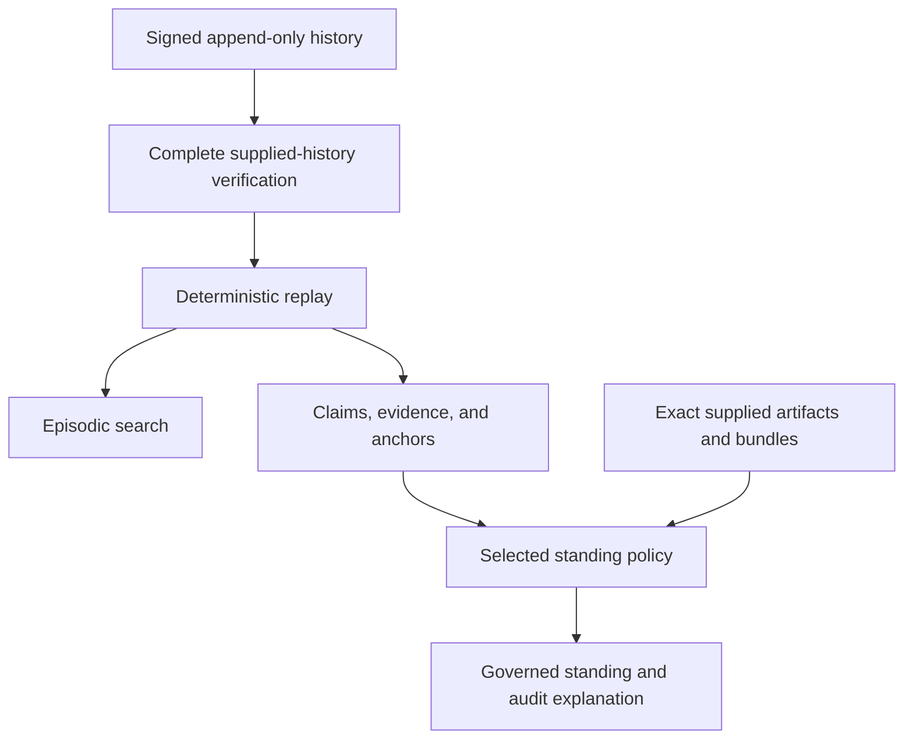

<a id="magpie"></a>

<div align="center">

<p><sub>LOCAL-FIRST &nbsp; / &nbsp; PROVENANCE-FIRST &nbsp; / &nbsp; REPLAYABLE</sub></p>

<h1>Magpie</h1>

<p><strong>Conserve the log. Derive the rest.</strong></p>

<p>A replayable memory kernel for AI systems.<br>Signed history. Explicit evidence. Policy-defined conclusions.</p>

<p>
  <a href="https://github.com/noctem-o/magpie/actions/workflows/ci.yml"></a>
  <a href="#current-boundary"></a>
  <a href="#portable-verification"></a>
  <a href="LICENSE-APACHE"></a>
</p>

<p>
  <a href="#quick-start">Quick start</a> &nbsp; · &nbsp;
  <a href="#how-magpie-works">Architecture</a> &nbsp; · &nbsp;
  <a href="#standing">Standing</a> &nbsp; · &nbsp;
  <a href="#current-boundary">Limits</a> &nbsp; · &nbsp;
  <a href="#documentation">Documentation</a>
</p>

</div>

---

Magpie keeps a signed, append-only history of what was recorded. Claims, evidence, provenance audits, search indexes, and policy conclusions are derived from that history. The historical record remains intact when derived state is rebuilt.

**A remembered claim should retain the distinction between what was said, what was checked, and what may follow.**

> [!IMPORTANT]
> **Experimental kernel.** Magpie is not a finished memory product. Successful verification establishes only the predicate checked against the supplied inputs; it does not establish truth, key ownership, freshness, global completeness, or permission to act. See the [current boundary](#current-boundary) and [audit disposition](docs/audits/audit-disposition-2026-08.md).

<table>
<tr>
<td width="33%" valign="top">
<sub>01 / RECORD</sub><br><br>
<strong>History you can inspect</strong><br><br>
An Ed25519-signed hash chain, canonical event bytes, explicit checkpoint expectations, and bounded local SQLite persistence.
</td>
<td width="33%" valign="top">
<sub>02 / REPLAY</sub><br><br>
<strong>State you can regenerate</strong><br><br>
Complete supplied-history verification before replay. Search and claim projections are rebuildable views over the record.
</td>
<td width="33%" valign="top">
<sub>03 / RESOLVE</sub><br><br>
<strong>Conclusions with boundaries</strong><br><br>
Explicit standing policies, immutable supplied content, provenance checks, and deterministic audit explanations.
</td>
</tr>
</table>

**Release coordinates:** latest GitHub source release [v0.3.0](https://github.com/noctem-o/magpie/releases/tag/v0.3.0) · tracked release contract **v0.1.0** · workspace packages **v0.1.0**. `main` may be ahead of the latest release. [Details ↓](#release-status)

## Why Magpie exists

An agent recalls a claim from last week. The text survived—but did its qualifications?

| What the agent finds | What still needs to be established |
| :--- | :--- |
| A search result | Whether it is relevant evidence for this claim. |
| Bytes matching a digest | Where those bytes came from and what they support. |
| Two agreeing reports | Whether they share an origin and qualify under the selected rule. |
| A successful deterministic check | The exact proposition that procedure checked. |
| Yesterday's policy conclusion | Which inputs and policy produced it, and whether it answers today's question. |

Magpie keeps these distinctions explicit. The signed log is historical authority **relative to the verifying key supplied by the caller**. Derived views explain the record and its policy consequences; they cannot rewrite it.

<details>
<summary><strong>The vocabulary: seven distinct questions</strong></summary>

| Term | Question |
| :--- | :--- |
| **Observation** | What did the recorded event say? |
| **Availability** | Were the exact bytes needed for the computation supplied? |
| **Verification** | Do those bytes satisfy the named checking procedure? |
| **Provenance** | How is an artifact connected to a recorded acquisition or derivation? |
| **Origin admission** | Is a contribution admitted into this exact origin comparison? |
| **Eligibility** | May this evidence participate in the selected policy rule? |
| **Governed standing** | What conclusion does that explicitly selected policy produce? |

</details>

## Quick start

From a repository checkout, run the workspace tests and the deterministic standing tour:

```sh
cargo test --workspace --locked
cargo run --locked --example tour -p magpie-claims
```

The [frozen tour](docs/design/governed-standing-tour-v1.md) creates and verifies one signed history, resolves policies **v0–v2**, deletes the derived state, and replays the history to check byte-identical regeneration. Policies **v3 and v4** are implemented and tested separately; they are outside the frozen tour output.

<details>
<summary><strong>Keep a ledger with the <code>magpie</code> command</strong></summary>

```sh
cargo install --locked --path crates/magpie-cli
magpie init ~/ledger                     # prints the verifying key; record it elsewhere
export MAGPIE_STORE=~/ledger
magpie claim "Theorem 2 holds" --domain OperationalObservation
magpie evidence "numerics agree to 1e-15" --kind ExecutionEvidence --file run.log
magpie link supports ev-2 claim-1 --rationale "numerical check"
magpie why claim-1 --policy v2           # the policy's own explanation
magpie verify                            # signatures, portable profile, checkpoint
```

Every read verifies the whole log first. There is no default policy. The log is JSONL, so `tools/verify_chain.py` can check it independently. The crate docs explain why it doesn't use the SQLite L0 yet, and how its rollback checkpoint works.

</details>

<details>
<summary><strong>Verify the golden history with the independent Python conformer</strong></summary>

Use the Python environment and dependencies described in the [development checks](#development), then run:

```sh
python tools/verify_chain.py \
  crates/magpie-log/testdata/golden-v1.jsonl \
  ea4a6c63e29c520abef5507b132ec5f9954776aebebe7b92421eea691446d22c
```

The verifier checks canonical encoding, sequence numbers, previous-hash links, stored hashes, signatures, genesis binding, and payload validity. The verifying key is supplied explicitly; the log does not authenticate its own trust root.

</details>

## How Magpie works



The replay path verifies one complete supplied record snapshot before publishing its authoritative replay result. The same retained events then feed the derived projections.

Policies that need external artifacts or foreign bundles receive those exact bytes through an **immutable content closure**. Resolution performs no ambient filesystem or network lookup to fill in missing evidence. Provenance, origin admission, and eligibility are evaluated where the selected rule requires them.

> [!NOTE]
> The diagram shows computation boundaries. A path through the diagram does not, by itself, establish evidence eligibility or promote standing.

### Workspace

| Crate | Owns | Produces |
| :--- | :--- | :--- |
| [`magpie-log`](crates/magpie-log) | Canonical encoding, signatures, hash chain, readers/writers, SQLite L0, complete verification, checkpoints, and replay. | The historical record and verification of supplied histories. |
| [`magpie-claims`](crates/magpie-claims) | Typed claims and evidence, immutable supplied content, provenance and origin checks, policies v0–v4. | Governed standing and one-way audit explanations. |
| [`magpie-episodic`](crates/magpie-episodic) | Rebuildable SQLite projection, FTS5, deterministic log-order search. | Searchable derived state with no write-back path to history. |
| [`magpie-cli`](crates/magpie-cli) | The `magpie` command: store setup, signed writes, verified reads, rollback checkpoints. | A claim ledger you can keep from the shell, exportable as `magpie-desk-export-v0`. |

## What works today

### Portable verification

<table>
<tr>
<th align="center">3 languages</th>
<th align="center">432 frozen cases</th>
<th align="center">7 result fields</th>
</tr>
<tr>
<td align="center">Rust · Python · Go</td>
<td align="center">19 ACCEPT · 413 REJECT</td>
<td align="center">Exact differential agreement</td>
</tr>
</table>

The selected [ADR 0010 signature profile](docs/adr/0010-ed25519-verification-profile-and-external-trust-root-admissibility.md) and [portable input language](docs/design/portable-verifier-input-language-contract.md) have complete conformers in all three languages.

- **Rust:** the public exact-byte `FileStore::verify_portable_history` path drives the authoritative portable-history conformer.
- **Python:** [`tools/verify_chain.py`](tools/verify_chain.py) is the readable independent reference conformer; the earlier [`tools/portable_verifier.py`](tools/portable_verifier.py) remains comparison evidence.
- **Go:** a [standalone conformer](tools/go-verify-chain/README.md) shares no Rust or Python verifier implementation. Its approved `filippo.io/edwards25519 v1.2.0` arithmetic dependency is vendored for offline builds.

The [differential runner](tools/check_portable_verifier_differential.py) checks the frozen manifest and exact case bytes before comparing `verdict`, `class`, `line`, `record_index`, `event_count`, `tip`, and `ordered_recomputed_hashes`. Bounded, non-normative Rust fuzz/metamorphic assurance additionally exercises the production conformer path.

**This is finite conformance evidence for one exact corpus and profile.** It is not a proof of verifier correctness, universal input equivalence, key trust, currentness, or release-environment portability. The [frozen corpus](docs/design/portable-verifier-corpus-v1.md) is an oracle, not a verifier.

### Persistence

| Backend | Intended role | Boundary |
| :--- | :--- | :--- |
| **`SqliteL0Store`** | Supported local persistent L0. | Separate creation and verified reopen; finite resource limits; stale-writer rejection and atomic successor append. |
| **`FileStore`** | JSONL compatibility, development, inspection, and portable verification. | Does not provide the supported durability or concurrent-writer boundary. |
| **`MemStore`** | In-memory tests and embedding. | No persistent-storage guarantee. |

Supported SQLite reopen checks L0 ownership, schema, storage profile, limits, and the complete retained history before publishing a writer or verified result. Append revalidates the persisted history inside the transaction that may add its successor. A stale writer must reopen; it is not silently refreshed or rebased.

[Read the persistence contract →](docs/design/l0-persistence-and-checkpoint-open-v0.md)

### Writing authority

`LogWriter` owns the signing key and is the low-level append capability. `LogReader` and derived projections cannot append. The optional Deadbolt anchor path has its own reviewed writer boundary.

An ordinary governed claim/evidence writer and `EpistemicGate` are **not implemented**. Recording an event does not automatically admit it into an epistemic process.

## Standing

**Governed standing** is the result of an explicitly chosen policy. Raw historical status remains available for audit; merely recording a status does not make it a governed conclusion. [ADR 0003](docs/adr/0003-canonical-definition-of-standing.md) defines the model.

| Policy | Rule introduced | Maximum new effect |
| :---: | :--- | :--- |
| **v0** | Candidate explanations, ceilings, and blockers. | Explanation without promotion. |
| **v1** | Exact same-replay Deadbolt occurrence and inclusion. | `Settled` for the exact occurrence/inclusion proposition. |
| **v2** | Exact deterministic direct support. | `Supported`, never `Settled`. |
| **v3** | Narrow external-report corroboration. | `Supported`, never `Settled`. |
| **v4** | Subject-bound deterministic direct refutation. | `Refuted` under conservative precedence. |

Policies have stable identities. **The caller chooses; there is no `resolved_standing_latest`.**

<a id="a-note-about-v3-and-origin-groups"></a>

> [!WARNING]
> **v3 retains compatibility semantics.** Distinct admitted origin groups are not proof of statistical, causal, or organisational independence. The current path does not independently authenticate the claimant's right to assign an origin group. [ADR 0007](docs/adr/0007-authority-bound-origin-corroboration.md) defines an accepted authority-bound successor; that runtime is not implemented.

### Why v4 owns its subject

The implemented v4 rule keeps both the **subject bytes and expected digest on the claim**. Evidence may identify and bind the route to that claim, but cannot substitute unrelated bytes and present their mismatch as refutation.

Parse and binding failures remain failures. Only the exact eligible negative path may produce `Refuted`, and multiple eligible candidates do not amplify the result: the direct rule applies at most once.

**When eligible counterevidence meets inherited `Supported` or `Settled`, v4 preserves that status and exposes an explicit contradiction blocker.** Consumers must read the qualification alongside the status; broader contradiction policy remains future work.

<details>
<summary><strong>The rejected substitution: evidence-selected bytes</strong></summary>

An earlier design allowed evidence to supply an unrelated `witness_hex`. A digest mismatch could then appear to refute the claim while establishing only that the evidence-selected bytes differed from the expected digest. That design was rejected. Claim-owned subjects keep the implemented rule bound to the proposition it actually checks.

[Read the v4 contract →](docs/design/standing-policy-v4-claim-inline-direct-refutation-v0.md)

</details>

## Rules Magpie refuses to blur

| Principle | Consequence |
| :--- | :--- |
| **History is append-only.** | Corrections are later signed events. Currentness and supersession are separate derived questions. |
| **Verification has a scope.** | Verified bytes do not establish provenance, independent origin, or truth. |
| **Failure is not falsity.** | Missing bytes, malformed metadata, bad signatures, failed bindings, and incomplete audits report their own failures. |
| **Repetition is not strength.** | Repeated anchors and audit outputs gain no authority through multiplicity. v3 collapses same-origin multiplicity; v4 applies its direct rule at most once. |
| **Audit output is explanatory.** | Authority-bearing audit types have no public caller-supplied deserialization route back into resolution. |
| **Policy is explicit.** | A new policy version does not silently replace the caller's selected semantics. |

### Verified history is not current history

A verified prefix establishes the validity of the **exact supplied history**, under the supplied key and limits. A longer valid history may exist elsewhere. Verification does not establish freshness, latest state, or global completeness.

`open_containing_checkpoint_v0` additionally checks whether that history contains an exact caller-supplied checkpoint. Success does not authenticate the checkpoint or establish secure retention, canonicality, or rollback resistance. [ADR 0009 →](docs/adr/0009-verified-supplied-history-and-explicit-checkpoint-expectations.md)

### A derived result must name what produced it

[ADR 0008](docs/adr/0008-complete-producing-coordinates.md) requires governed detached results to identify their complete producing inputs: history, policy, exact supplied artifacts, subjects, inherited results, and applicable authority inputs. Equal-looking outputs can have different derivations.

**That doctrine does not retrofit every existing API.** Legacy public results remain coordinate-poor; coordinate-complete detached verification/replay results are not advertised as implemented. See the [current boundary](#current-boundary).

## Deadbolt integration

**Deadbolt acts. Magpie remembers.** The optional connection is a protocol boundary, not a Rust crate dependency. Magpie can be used without Deadbolt.

A `SegmentAnchored` event records one sealed foreign bundle's identity:

| Identity field | |
| :--- | :--- |
| Kind and run | `bundle_kind` · `run_id` |
| Witness | `witness_root` · `witness_algorithm` |
| Encoding | `canonicalization_profile` |

Magpie verifies inclusion of the anchor event and its exact fields in the signed history. **The foreign verifier remains responsible for the bundle's contents.** New bundle kinds can use new `bundle_kind` values without a new Magpie event variant.

[Protocol decision](docs/adr/0001-deadbolt-seam.md) · [Anchor contract](docs/seams/deadbolt-anchor-contract.md) · [Portable base](docs/portable-base.md)

## Current boundary

### Implemented today

- **History:** canonical signed events and golden vectors; append-only hash chain; complete verification before replay.
- **Storage:** bounded local SQLite L0; verified reopen; explicit prefix/checkpoint semantics; stale-writer detection and atomic successor append.
- **Portability:** complete Rust, Python, and Go conformers; frozen 432-case corpus; exact seven-field differential and bounded Rust assurance.
- **Derived state:** rebuildable search and claims; typed evidence and edges; immutable supplied content; provenance, origin-admission, and contribution audits.
- **Resolution:** explicit policies v0–v4; deterministic support; compatibility corroboration; subject-bound direct refutation; one-way audit explanations.
- **Integration:** optional Deadbolt bundle anchoring.

### Explicitly not implemented

| Area | Remaining scope |
| :--- | :--- |
| **Trust and retention** | Secure retained checkpoints, stronger rollback resistance, production key custody and rotation. |
| **Portable outputs** | Coordinate-complete detached verification/replay results for an advertised governed detachable-result boundary. |
| **Admission** | Authority-bound origin-group admission under ADR 0007; an ordinary governed claim/evidence writer; `EpistemicGate`. |
| **Acquisition** | Acquisition loading, content-addressed storage, filesystem and network ingestion. |
| **Knowledge lifecycle** | Broader contradiction policy and contradiction debt; runtime currentness, invalidation, and supersession under ADR 0006; broader propagation of source standing. |
| **Agent access** | A read-only librarian or research navigator. |
| **Qualification** | Broader platform and release-environment qualification beyond the frozen three-way differential corpus. |

These are capability boundaries, not an automatically authorized roadmap. Accepted doctrine, implemented runtime, audit disposition, and release readiness are separate states.

### What Magpie is not

Magpie is not a chatbot, autonomous research agent, vector database, mutable knowledge graph, general truth engine, statistical-independence oracle, automatic contradiction resolver, crawler, public ingestion service, or production key-management system. It does not silently choose the newest policy.

[Audit disposition](docs/audits/audit-disposition-2026-08.md) · [Pre-alpha convergence](docs/audits/public-pre-alpha-convergence-reassessment-2026-08-22.md) · [Preserved audits](docs/audits/README.md)

## Documentation

Choose a starting point; expand a reference shelf when you need the exact rules.

| If you want to… | Start here |
| :--- | :--- |
| Understand the signed record | [FORMAT](docs/FORMAT.md) |
| Run the deterministic example | [Standing tour](docs/design/governed-standing-tour-v1.md) |
| Understand storage and checkpoints | [L0 persistence](docs/design/l0-persistence-and-checkpoint-open-v0.md) |
| Inspect the portable verifier contract | [Input language](docs/design/portable-verifier-input-language-contract.md) · [Frozen corpus](docs/design/portable-verifier-corpus-v1.md) |
| Understand evidence and policy | [Standing ceilings](docs/design/standing-view-evidence-ceilings.md) · [Provenance and origin admission](docs/design/artifact-provenance-origin-admission.md) |
| Review development history | [Tickets](tickets/) · [Working rules](AGENTS.md) |

<details>
<summary><strong>Architecture decisions · ADR 0001–0010</strong></summary>

| Decision | Subject |
| :--- | :--- |
| [0001](docs/adr/0001-deadbolt-seam.md) | Deadbolt protocol connection. |
| [0002](docs/adr/0002-governed-claim-memory.md) | Governed claim memory and raw-status quarantine. |
| [0003](docs/adr/0003-canonical-definition-of-standing.md) | Canonical standing model. |
| [0004](docs/adr/0004-claim-lifecycle-facets.md) | Derived lifecycle facets. |
| [0005](docs/adr/0005-claim-withdrawal-acts.md) | Withdrawal without claiming falsity. |
| [0006](docs/adr/0006-claim-currency-and-currentness-semantics.md) | Currentness and supersession doctrine. |
| [0007](docs/adr/0007-authority-bound-origin-corroboration.md) | Authority-bound origin assignment; successor runtime is unimplemented. |
| [0008](docs/adr/0008-complete-producing-coordinates.md) | Complete immutable producing inputs for governed detached results. |
| [0009](docs/adr/0009-verified-supplied-history-and-explicit-checkpoint-expectations.md) | Supplied-history verification and explicit checkpoint expectations. |
| [0010](docs/adr/0010-ed25519-verification-profile-and-external-trust-root-admissibility.md) | Accepted, owner-ratified Ed25519 subprofile implemented by the portable conformers. |

Accepted decisions describe doctrine. Their individual runtime and evidence status must be read separately; acceptance does not implement a mechanism or establish release readiness.

</details>

<details>
<summary><strong>Verification and standing · implementation contracts</strong></summary>

- [Portable input language](docs/design/portable-verifier-input-language-contract.md)
- [Rust frontend contract v0](docs/design/portable-verifier-rust-frontend-contract-v0.md)
- [Rust history conformer contract v0](docs/design/portable-verifier-rust-history-conformer-contract-v0.md)
- [Portable verifier corpus v1](docs/design/portable-verifier-corpus-v1.md)
- [Standing ceilings](docs/design/standing-view-evidence-ceilings.md)
- [Provenance and origin admission](docs/design/artifact-provenance-origin-admission.md)
- [Policy v3: external-report corroboration](docs/design/standing-policy-v3-external-report-corroboration-v0.md)
- [Policy v4: claim-inline direct refutation](docs/design/standing-policy-v4-claim-inline-direct-refutation-v0.md)

The corpus is owner-approved, merged, exact-byte, frozen oracle material. Finite agreement does not itself prove verifier correctness or close a finding; consult the separate owner-reviewed [disposition record](docs/audits/audit-disposition-2026-08.md).

</details>

<details>
<summary><strong>Agent and query boundaries · design references</strong></summary>

- [MCP boundary](docs/design/mcp-boundary-contract.md)
- [MCP librarian](docs/design/mcp-librarian-contract.md)
- [Verified librarian query](docs/design/verified-librarian-query-contract.md)
- [Provenance response](docs/design/provenance-response-contract.md)
- [MCP capability boundary](docs/design/mcp-capability-boundary-contract.md)
- [AgentProposer boundary](docs/design/agent-proposer-boundary-contract.md)

These documents separate reading, proposing, querying, and authority. They do not imply that a librarian or MCP runtime is present.

</details>

<details>
<summary><strong>Admission research · questions and proposed contracts</strong></summary>

- [Boundary questions](docs/design/admission-boundary-questions.md)
- [Threat model](docs/design/admission-boundary-threat-model.md)
- [Readiness checklist](docs/design/admission-design-readiness-checklist.md)
- [Scenario analysis](docs/design/admission-boundary-scenario-analysis.md)
- [Minimal semantics](docs/design/admission-boundary-minimal-semantics.md)
- [Record boundary](docs/design/admission-record-boundary-contract.md)
- [Evidence admission](docs/design/evidence-admission-boundary-contract.md)
- [Pipeline separation](docs/design/epistemic-pipeline-separation-contract.md)
- [Epistemic boundary map](docs/design/epistemic-boundary-map.md)
- [Invariant ledger](docs/design/epistemic-invariant-ledger.md)

Status matters: exploratory questions and proposed contracts are not runtime behaviour or implementation authorization.

</details>

## Development

The [CI workflow](.github/workflows/ci.yml) records the current validation setup, including Python dependencies. The [Go conformer guide](tools/go-verify-chain/README.md) covers both POSIX and PowerShell usage. These are source-checkout workflows; this README does not claim registry availability.

<details>
<summary><strong>Rust · formatting, tests, linting</strong></summary>

```sh
cargo fmt --all --check
cargo test --workspace --locked
cargo test --doc --locked
cargo clippy --workspace --all-targets --locked -- -D warnings
```

The default Rust test graph includes bounded portable-verifier smoke assurance. The larger deterministic campaign is opt-in:

```sh
cargo test -p magpie-log --locked --lib assurance_a_extended -- --ignored
```

</details>

<details>
<summary><strong>Conformance · corpus integrity, Python, Go, and differential checks</strong></summary>

```sh
python tools/check_verifier_corpus_manifest.py
python tools/check_release_metadata.py
python -m unittest tools.test_portable_verifier tools.test_verify_chain tools.test_portable_verifier_differential -v
python tools/check_portable_verifier_python.py
go -C tools/go-verify-chain test -mod=vendor -count=1 ./...
go -C tools/go-verify-chain vet -mod=vendor ./...
go -C tools/go-verify-chain build -mod=vendor -o go-verify-chain .
./tools/go-verify-chain/go-verify-chain --check-manifest fixtures/verifier-language-v1/manifest.json
python tools/check_portable_verifier_differential.py --repeat 2
```

The Go commands above use a POSIX shell. The [Go guide](tools/go-verify-chain/README.md) provides PowerShell equivalents and defines the direct executable's governed `0` / `1` / `2` exit contract. `go run` is not that governed interface.

</details>

Focused hostile and integration tests also cover provenance, origin admission, v3/v4 standing, raw-status quarantine, same-replay binding, failure ordering, non-amplification, and canonical audit vectors.

Changes should remain small, typed, replayable, and explicit about what grants authority. [Contributing →](CONTRIBUTING.md) · [Reporting a vulnerability →](SECURITY.md)

## Release status

| Coordinate | Current boundary |
| :--- | :--- |
| **GitHub source release** | [v0.3.0](https://github.com/noctem-o/magpie/releases/tag/v0.3.0). Earlier releases are listed in the [changelog](CHANGELOG.md). |
| **Tracked formal release contract** | [v0.1.0](docs/releases/v0.1.0-contract.md). The v0.2.0 and v0.3.0 source releases have no equivalent tracked release-contract document. |
| **Workspace package version** | `0.1.0`, which is what `magpie --version` prints. No registry publication or package availability is claimed. |
| **Development** | `main` may be ahead of the latest source release. Experimental status remains. |

---

<p align="center">
  <strong>Conserve the log. Derive the rest.</strong><br>
  <sub>Magpie · Apache-2.0 · Experimental</sub><br><br>
  <a href="#magpie">Back to top ↑</a>
</p>
